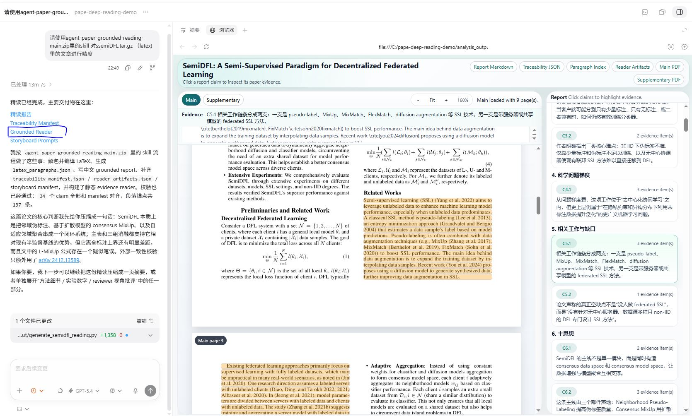

# Agent Paper Grounded Reading

[English README](./README.md)



`agent-paper-grounded-reading` 是一个面向 **Codex、Trae、Claude Code / CC 以及类似本地 AI Agent 工作流** 的论文精读 skill 包。

它不是普通摘要器。
这个项目的目标是同时做到两件事：

1. **grounded 可追溯**
   让报告里的关键判断都能回查到 PDF / LaTeX 原始证据。
2. **research-generative 可产出新 idea**
   不只解释论文做了什么，还要解释作者可能怎么想到这个方向、为什么这样组织 story、哪些隐藏假设可以继续往前推成下一篇论文。

## 这个项目现在会产出什么

默认会要求 agent 产出以下文件：

1. `report.md`
   面向人阅读的精读主报告。
2. `traceability_manifest.json`
   报告 claim 到原始证据的映射。
3. `latex_paragraphs.json`
   LaTeX 段落锚点，保留源码路径与行号。
4. `research_lens.json`
   研究生成视角的结构化中间产物，提炼论文的 research equation、challenge-to-module 结构、story pattern 和后续 idea 方向。
5. `reader_artifacts.json`
   静态 reader 的输入清单。
6. 可选 storyboard 产物
   当运行环境支持图片生成时，额外输出分镜 prompt 或图片。

## 合并后的分析方法学

这次更新把原有 grounded 精读要求和 `research_generative_paper_reading_skill.md` 的方法学做了融合。
新的主 skill 会同时要求 agent 覆盖这些重点：

1. 论文身份与实际使用的 source package
2. 一句话 thesis 与 research equation
3. 标题拆解与真实问题
4. scientific problem ladder
5. 作者可能如何发现这个方向
6. 作者如何把 story 搭起来
7. related work 与关键 citation 的叙事角色
8. 公式、理论、模块、图表、实验的逐层解释
9. claims 与 evidence 是否真的对齐
10. 这篇论文最值得复用的 story-making pattern
11. 隐藏假设、脆弱点与边界推进方向
12. 最后用一个简洁但忠实的故事收束全文

## 目录结构

- [SKILL.md](./SKILL.md)
  主 skill 说明。
- [agents/openai.yaml](./agents/openai.yaml)
  面向工具 UI 的展示元数据。
- [references](./references)
  包含 traceability contract、reader contract，以及新增的 research-generative 方法学参考。
- [templates](./templates)
  包含报告模板、traceability 模板、reader artifact 模板、storyboard 模板和新增的 `research_lens.json` 模板。
- [scripts](./scripts)
  包含段落抽取、traceability 校验、reader bundle 构建和本地预览脚本。
- [assets/reader_template](./assets/reader_template)
  静态证据阅读页模板。

## 页面能力

主 skill 自带静态 reader 页面。
构建完成后，页面可以：

- 左侧查看 PDF，右侧查看报告
- 点击 claim 高亮对应证据
- 在有 LaTeX / SyncTeX 时优先做精确定位
- 读取 `research_lens.json`，把 research equation、story logic 和 future ideas 以页面卡片形式展示出来

## 快速使用

如果输入是 LaTeX 源码包，可以这样说：

```text
请使用 agent-paper-grounded-reading 对 paper.tar.gz 做 grounded 精读，同时提取研究视角下的新 idea。
```

如果输入是 PDF，可以这样说：

```text
请使用 agent-paper-grounded-reading 对 paper.pdf 做精读；如果能找到匹配的 arXiv LaTeX，就切换到 LaTeX-primary，并输出 report.md、traceability_manifest.json、research_lens.json。
```

如果还想要静态页面：

```text
在完成报告和中间产物后，再构建静态 evidence reader。
```
